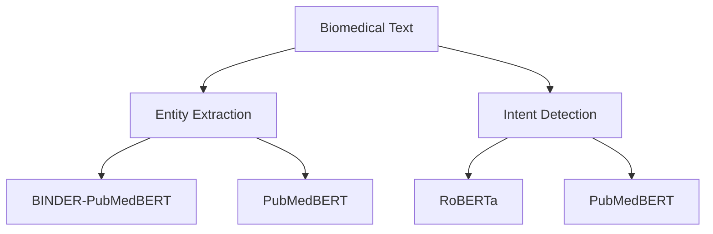
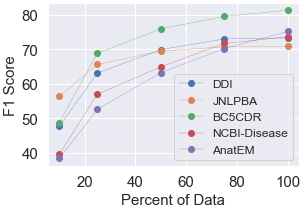
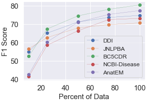

# Intent Detection and Entity Extraction from BioMedical Literature

This is the official repository of the paper **Intent Detection and Entity Extraction from BioMedical Literature**. 



## Model Demo

PubMedBERT fine-tuned on BC5CDR dataset [(Hugging Face Demo Link)](https://huggingface.co/psgrghvuo/pubmedbert_bc5cdr) and RoBERTa fine-tuned on translated KUAKE-QIC dataset [(Hugging Face Demo Link)](https://huggingface.co/psgrghvuo/roberta-base-qic) are shared for demo.


## Repository Organization

```bash
├── Chinese_ID_validation/
|    ├── CMID_validation.txt
|    ├── KUAKE-QIC_validation.txt
├── ID_datasets/
|    ├── test_mergedNER.csv
|    ├── train_mergedNER.csv
├── model_cnn_lstm_ner/
|    ├── crf.py
|    ├── dataset.py
|    ├── main.py
|    ├── model.py
|    ├── train.py
|    ├── utils.py
├── model_handcrafted_features_ner/
|    ├── main.py
├── model_transformer_id/
|    ├── main.py
├── model_transformer_ner/
|    ├── main.py
├── NER_datasets/ 
|    ├── train_ncbi.txt
|    ├── test_ncbi.txt
|    ├── train_jnlpba.txt
|    ├── test_jnlpba.txt
|    ├── train_bc5cdr.txt
|    ├── test_bc5cdr.txt
|    ├── train_anatem.txt
|    ├── test_anatem.txt
|    ├── train_drugbank.txt
|    ├── test_drugbank.txt
|    ├── train_medline.txt
|    ├── test_medline.txt
├── run_id_experiments.sh
├── run_ner_experiments.sh
├── README.md
```

## Files Descriptions

1. **Chinese_ID_validation** - This folder contains the manual translation validation results for CMID and KUAKE-QIC datasets.
2. **ID_datasets** - This folder contains the train-test splits of mergedNER Intent Detection dataset.This dataset is made by merging train-test splits of Drug-Drug Interaction (DDI) dataset, NCBI Diease Dataset and JNLPBA Dataset.
3. **model_handcrafted_features** - This folder contains the code for running Logistic Regression and XGBosst models for NER.
4. **model_transformer_id** - This folder contains the code for running transformer models for Intent Detection.
5. **model_transformer_ner** - This folder contains the code for running transformer models for NER. Please refer to [BioBERT repository](https://github.com/dmis-lab/biobert-pytorch) for more details.
6. **NER_datasets** - This folder contains the train-test splits of the 5 biomedical NER datasets - Drug-Drug Interaction Dataset, JLPBA, BC5CDR, NCBI-Disease and, Anatomy Entity Mention Dataset. All the datasets converted to [CoNLL format](http://ufal.mff.cuni.cz/conll2009-st/task-description.html) and processed using processing steps used in [BioBERT repository](https://github.com/dmis-lab/biobert-pytorch). 
7. **run_id_experiments.sh** - Shell file for running Intent Detection experiments.
8. **run_ner_experiments.sh** - Shell file for running NER experiments.

## How to run the NER Experiments

- Preprocess the uploaded the dataset files to break the text examples considering the max token length. Change the variable "model" in run_experiments.sh and use the shell script to evaluate the model on all biomedical datasets:

    ``` 
    bash run_ner_experiments.sh
    ```
- Experiment outputs are written in the output directory.
- We use the open source implementation of [BINDER](https://github.com/microsoft/binder) for experiments with different encoder setups.

## How to run the Intent Detection (ID) Experiments

- Download the CMID/KUAKE-QIC datasets into ID_datasets directory or use the provided mergedNER dataset and run the shell script to evaluate the transformer models:

    ``` 
    bash run_id_experiments.sh
    ```
- Experiment outputs are written in the output directory.
- We use the train set of KUAKE-QIC dataset for training and dev set for testing. Train-test split for CMID was done by us. For mergedNER dataset we use the train and test splits of respective NER datasets. In mergedNER dataset, DDI (Drug Drug Interaction) dataset examples are used for drug intent, NCBI Diease dataset examples are used for disease intent and JNLPBA dataset examples were used for Genetics intent.
- Fasttext and TextCNN experiments were done with open source implmentations and as per the hyperparameters provided in the CMID paper.


## Biomedical Search Query Trend on Google and Bing

- [Google Trends](https://trends.google.com/) was used for determing the increase in google search of 5 topics (Health, Medical Treatment, Medical diagnosis, Disease, Pharmaceutical drug) from 1st Jan 2012 to 31st Dec 2022. Figure 1(a) in the paper shows increase in number of searches on these topics over the years.

- Bing query log of 10th Jan of each year is used. 200 list type queries are randomly selected for each year and manually labeled as biomedical or non-biomedical. In Figure 1(b), we plot the percentage increase in percent of the biomedical queries each year.


## NER: Implementation Details
- **Setting A:** Per device batch size of 16 was used on four Tesla T4 gpu with 16 GB memory each. Pretrained architectures are fine-tuned for 30 epochs using a learning rate of 5e-5 with AdamW optimizer and 10\% warmup steps.

- **Setting B:** Per device batch size of 16 was used on four Tesla T4 gpu with 16 GB memory each. Pretrained architectures are fine-tuned for 30 epochs using a learning rate of 5e-5 with AdamW optimizer and 10\% warmup steps. Number of training steps per second for PubMedBERT on NCBI Disease corpus was 2.67.

- **Setting C:** Models are trained for 100 epochs with early stopping if the performance saturates. Batch size of 10 was used on single Tesla T4 gpu with 16 GB memory. Learning rate of 0.015 on SGD optimizer was used. A dropout layer with dropout of 0.5 is used on top of LSTM layer. Time taken per epoch for NCBI-Diease corpus on LSTM was 7 seconds.

- **Setting D:** Following types of hand-crafted word level features were used with ML classifier: (i) POS tag (ii) shallow parsing features like chunk tag (iii) orthographic boolean features like all capital, is alphanumeric etc. (iv) n-gram features (v) morphological features like prefix and suffix (vi) contextual features like the feature set of the previous/next word. We use the GENIA tagger (http://www.nactem.ac.uk/GENIA/tagger/) for POS and Chunk tag extraction. Word level features are extracted using spacy(https://spacy.io/). Logistic regression model was trained with multinomial loss and XGBoost classifier was trained with gbtree booster

- **Setting E:** We use open source implementation of BINDER(https://github.com/microsoft/binder). Due to large memory requirements per device batch size of 1 was used on four Tesla T4 gpu with 16 GB memory each. Model with pretrained encoders are fine-tuned for 20 epochs using a learning rate of 3e-5.

- **Setting F:** Prompt Design for NER:
    ``` 
    NER_prompt = f'''You are an excellent linguist with biomedical expertise. The task is to label [{entity}] entities in the given sentence.  
    Short decription of [{entity}] entities: {entity_description}
    The [{entity}] entity starts must with @@ and end with ##

    Below are some examples:

    Input: {Input Example-1}
    Output: {Tagged with all entity starting with @@ and ending with ##}

    Input: {Input Example-2}
    Output: {Tagged with all entity starting with @@ and ending with ##}

    Input: {text}
    Output:'''
    ```

Where, entity is the named biomedical entity that we want to label, entity_description is a short desciption of the entity, text is the input text from the test set. Input Example-1 and Input Example-2 are sampled from the training set. Each instance of entity type is surrounded by @@ and ## to mark the entity boundaries in the output generated text. Model is expected to follow this structure with the given instructions and examples.

## Indent Detection: Implementation Details

- **Transformer Architectures:** Per device batch size of 16 was used on four Tesla T4 gpu with 16 GB memory each. Fine-tuning of pretrained architectures was done for maximum 8 epochs using a learning rate of 5e-5 with AdamW optimizer and 10\% warmup steps. Due to short queries, maximum token length of 128 was used with CMID and KUAKE-QIC dataset, and token length of 512 was used with NER Merged dataset.

- **FastText:** We use the open-source implementation of FastText(https://fasttext.cc/) for our experiments.

- **TextCNN:** The CNN architecture is similar to the one used by CMID. The models is trained for 20 epochs with an early stopping if the performance saturates. Learning rate of 0.01 was used with Adam optimizer and batch size of 64. Along with TextCNN, we use pre-trained Glove 6 Billion tokens 300 dimensions word embeddings (https://nlp.stanford.edu/projects/glove/).

- **LLMs:** Prompt Design for Intent Detection:
    ``` 
    ID_prompt = f'''You are a helpful biomedical expert. You can classify the given biomedical queries into one of the four intent classes.
    intent_classes: {all_intent_classes}

    Below are some examples:
    (
    biomedical_query: {example query of intent-1}
    intent_class: {inetnt-1}
    ),
    (
    biomedical_query: {example query of intent-2}
    intent_class: {inetnt-2}
    ),
    (
    biomedical_query: {example query of intent-3}
    intent_class: {inetnt-3}
    )

    You must output one of the {number_intents} intent classes for the following biomedical query. Do not output anything else.
    Your output must be in the following format:
    (
    biomedical_query: <given query>
    intent_class: <your predicted intent class>
    )

    (
    biomedical_query: {query}
    intent_class:'''
    ```

Where, all_intent_classes is the list of all intents in the dataset. We include one example per intent class in the prompt, number_intents is the number of intent classes in the dataset, query is the biomedical query from the test set that we want to label.Jo 


## Ablations
Performance variation with training data size on CNN and LSTM models along with CRF prediction layer is shown below. Unlike pre-trained transformer models, CNN and LSTM models fail to perform well when less training data is available. Ablation curves with BINDER-PubMedBERT and PubMedBERT are inluded in the paper.

### CNN + CRF

### LSTM + CRF



## Intent Detection Translation validation

- Please refer to [CMID paper](https://bmcmedinformdecismak.biomedcentral.com/articles/10.1186/s12911-020-1122-3) and [CBLUE repository](https://github.com/CBLUEbenchmark/CBLUE) for original datasets in Chinese. Datasets are translated to english using Google Translate API. We take a random sample of 400 examplese from CMID and 400 random examples from Dev set of KUAKE-QIC dataset for manual validaiton by two Chinese experts. Apart from translation validation, we also provide correct manual translations in some cases. 
- More details on the process of translation validation are highlighted on [Chinese_ID_validation page](https://github.com/psgrghvuo/nlu-biomedical/tree/main/Chinese_ID_validation).

## References
* [Domain-Specific Language Model Pretraining for Biomedical Natural Language Processing](https://arxiv.org/pdf/2007.15779)
* [BioBERT: a pre-trained biomedical language representation model for biomedical text mining](http://doi.org/10.1093/bioinformatics/btz682)
* [Don't Stop Pretraining: Adapt Language Models to Domains and Tasks](https://arxiv.org/abs/2004.10964)
* https://github.com/jiesutd/NCRFpp
* https://github.com/melanietosik/maxent-ner-tagger
